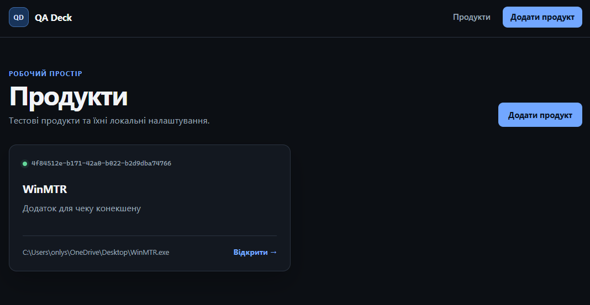
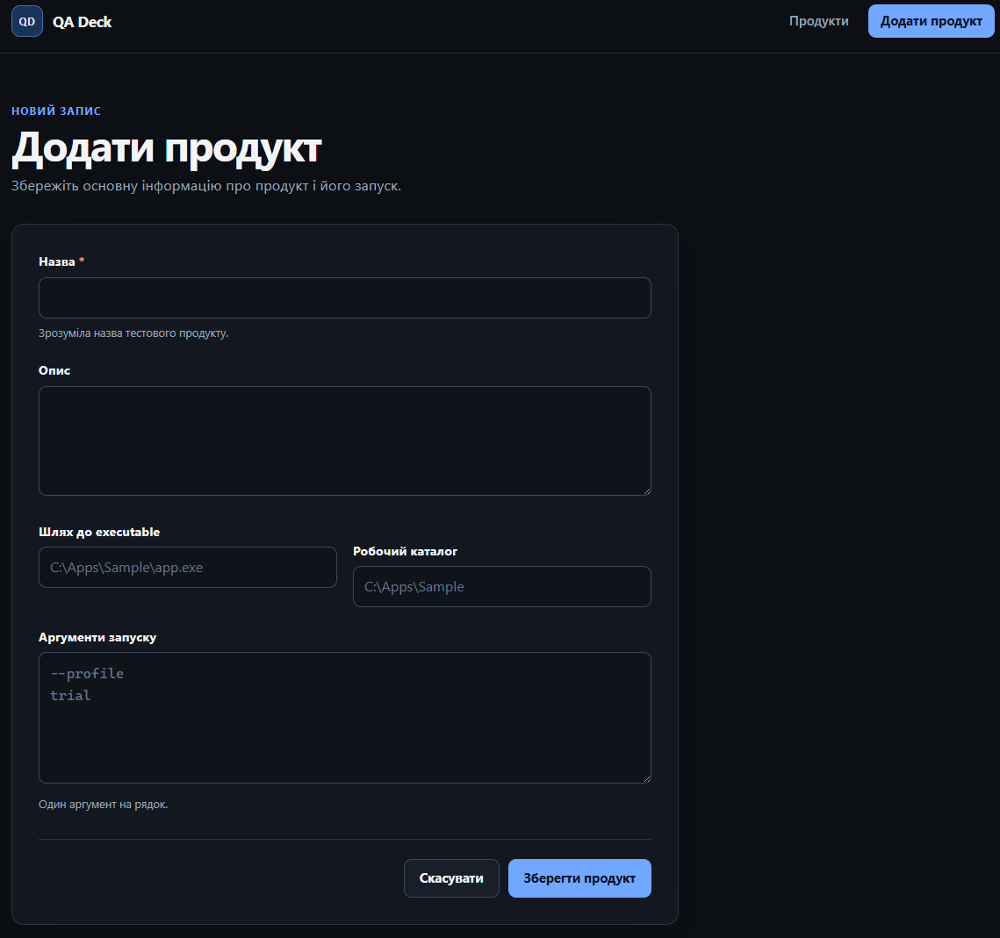
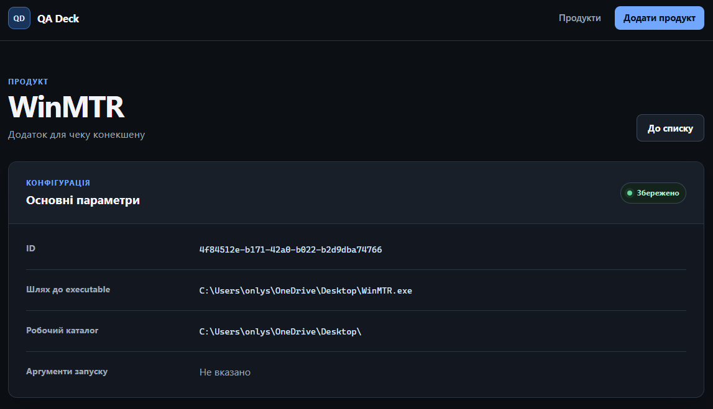
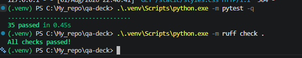

# Звіт за тиждень 1 — фундамент QA Deck

## 1. Мета тижня

Мета першого тижня — створити робочу основу QA Deck. Потрібно було підготувати структуру Python-проєкту, додати першу модель предметної області та просте локальне збереження даних. Також я планував зробити мінімальний вебінтерфейс і налаштувати перевірку коду.

## 2. Що зроблено

- створено Python-проєкт із `src-layout`, `pyproject.toml` і фабрикою застосунку `create_app()`;
- додано Flask `Blueprint`, вебмаршрути та перевірку стану `/health`;
- реалізовано модель `Product` з основними параметрами запуску;
- додано перевірку обов’язкових полів і нормалізацію шляхів без звернення до файлової системи;
- створено `ProductRepository`, який зберігає продукти в локальному JSON-файлі;
- реалізовано форму створення продукту, список продуктів і сторінку з параметрами одного продукту;
- додано прості Jinja-шаблони та адаптивне оформлення без JavaScript;
- написано тести для моделі, сховища й вебінтерфейсу;
- налаштовано pytest і Ruff.

## 3. Основні технічні рішення

Модель `Product` не залежить від Flask. Вона відповідає за свої дані, базову перевірку та перетворення через `to_dict()` і `from_dict()`.

Роботу з JSON винесено в `ProductRepository`. Шлях до файла задається через `PRODUCT_DATA_PATH`. `ProductRepository` реєструється в `app.extensions`, у тестах шлях до сховища підміняється тимчасовим каталогом tmp_path, тому реальні дані застосунку не змінюються.

Вебчастина створюється через `create_app()` і використовує окремий `Blueprint`. Для нового продукту id генерується через `uuid4`, тому користувач вводить лише потрібні дані.

## 4. Обґрунтування обраного підходу

На початку я розглядав варіант вузького інструмента для одного тестового продукту. Такий варіант був би простішим на старті, але його було б складно повторно використовувати для інших продуктів.

Тому я обрав розширювану платформу, у якій `Product` є центральною сутністю. Роботу з файлами, налаштуваннями, Registry, логами та іншими ресурсами планується додавати через плагіни. Це дасть змогу застосовувати однаковий підхід до різних продуктів і не переносити Windows-специфічну логіку в ядро. Plugin API та самі плагіни ще не реалізовані.

## 5. Як перевіряв роботу

Я запустив повний набір автоматичних перевірок:

- `python -m pytest` — 35 тестів пройдено;
- `python -m ruff check .` — Ruff не знайшов проблем.

Тести працюють із `tmp_path` і не записують дані в робочий каталог застосунку.

Також я вручну перевірив основний сценарій: створення продукту через форму, його появу в списку та відкриття сторінки зі збереженими параметрами.

## 6. Виявлені труднощі та ризики

### Консистентність предметної моделі

На початку існував ризик змістити проєкт у бік test runner, окремого інструмента діагностики або абстрактного менеджера середовищ. Це важливо, бо нечітке призначення ускладнило б подальшу розробку. Щоб зберегти узгоджену модель, `Product` визначено центральною сутністю, а інші можливості планується підключати через плагіни.

### Межа між ядром і плагінами

Файлові операції, Registry, запуск програм і збір логів можуть створити сильну залежність ядра від Windows. Тоді код стане складніше тестувати, підтримувати й розширювати. Тому ядро планується залишити простим, а такі можливості реалізовувати через `Plugin API` та незалежні плагіни.

### Перевірка інтерфейсу

Під час ручної перевірки я помітив окрему проблему з розміткою. Вона впливає на якість роботи з інтерфейсом, але її точну причину ще не встановлено. На наступному етапі проблему потрібно локалізувати, відтворити стабільним способом і виправити.

## 7. Що поки не реалізовано

- редагування та видалення продуктів;
- запуск executable;
- перевірка шляхів на диску;
- Plugin API, Plugin Manager і пошук плагінів;
- Executable Inspector;
- snapshots, profiles і workflows.

Поточне JSON-сховище розраховане лише на просту локальну роботу.

Зараз QA Deck відкривається у звичайному браузері. У майбутньому можна додати launcher, який відкриватиме локальний вебінтерфейс в окремому вікні без адресного рядка. Browser app mode або pywebview розглядаються лише як можливі варіанти, остаточне рішення ще не обрано.

## 8. Наступний крок

Далі я планую визначити мінімальний `Plugin API`, додати `Plugin Manager` і локальний пошук плагінів. Після цього можна перейти до Executable Inspector, а потім поступово готувати `Plugin Configuration` і File Operations.

## 9. Артефакти

- [Репозиторій QA Deck](https://github.com/NotJod563/qa-deck)
- [README](../../README.md)
- [Контекст проєкту](../PROJECT_CONTEXT.md)
- [Архітектурні рішення](../DECISIONS.md)
- [План розробки](../ROADMAP.md)

### Список збережених продуктів

### Форма створення продукту

### Сторінка з параметрами продукту

### Результати перевірок

