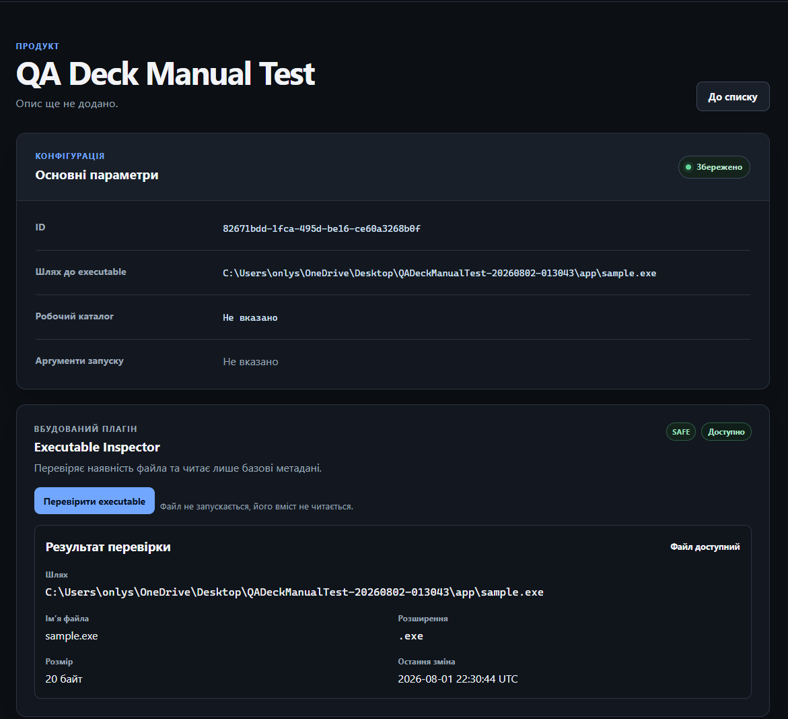
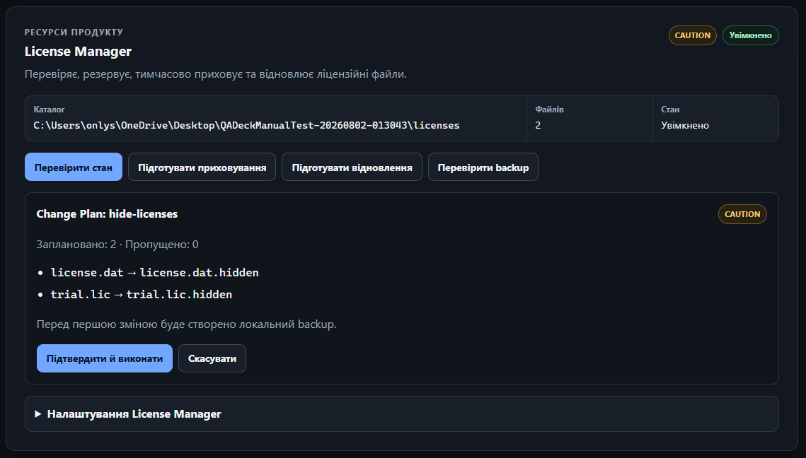
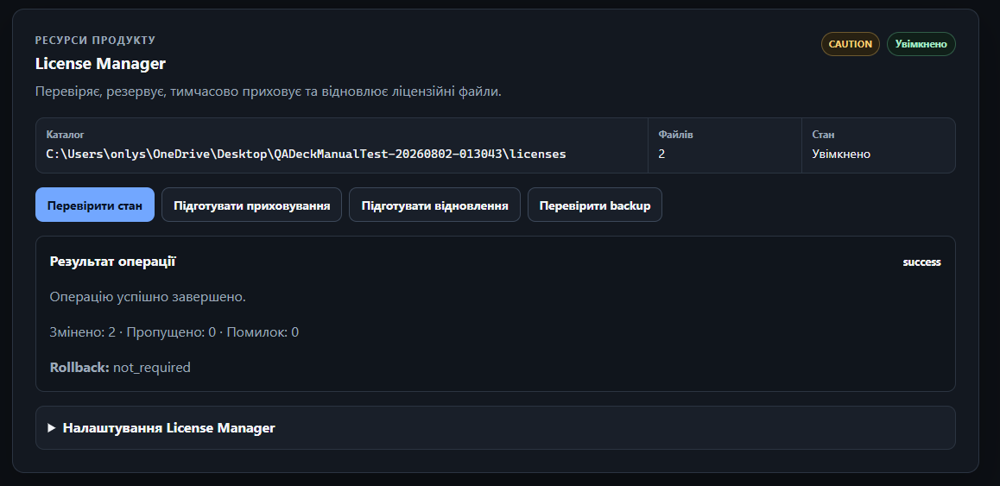
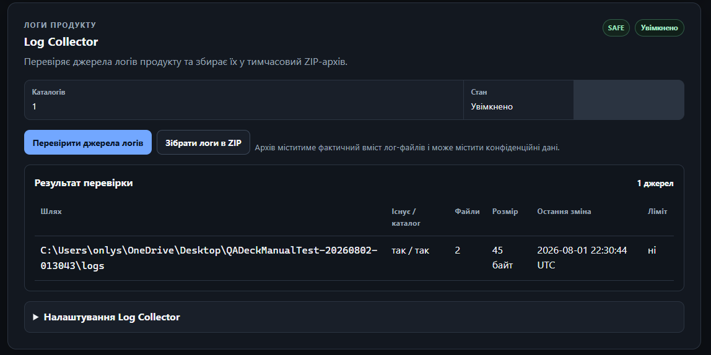
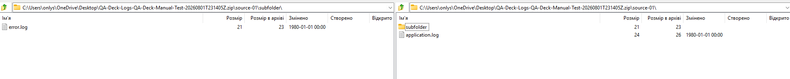
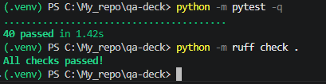
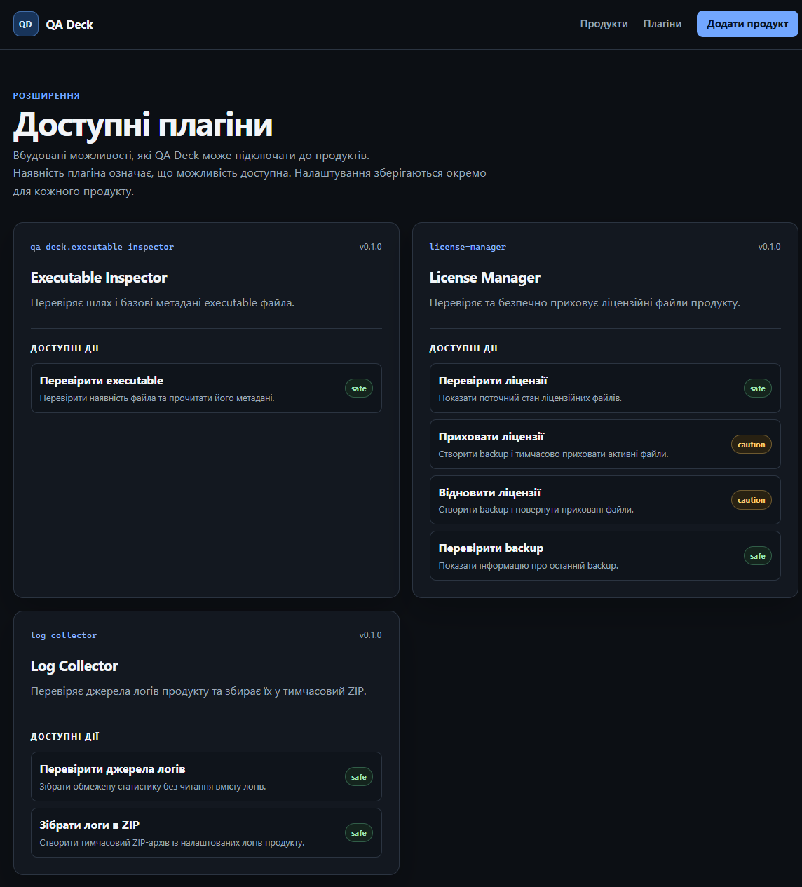
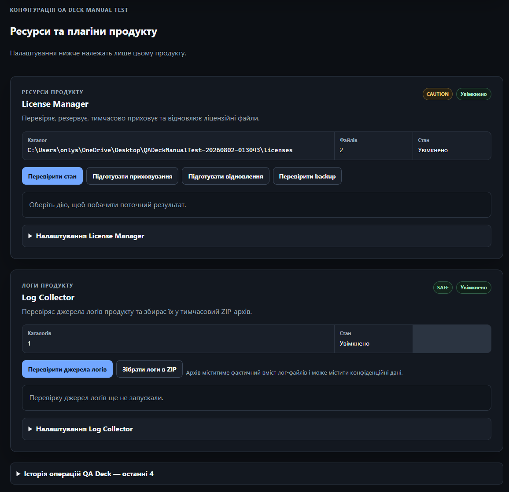

# Звіт за тиждень 2 — Плагіни та ресурси продукту

## 1. Мета тижня

Метою другого тижня було підготувати основу плагінної системи й перевірити її на практичних сценаріях. Робота мала залишатися прив’язаною до конкретного `Product`, не переносити файлову логіку у Flask routes і не додавати Windows-залежності до ядра.

## 2. Що зроблено

За тиждень реалізовано:

- мінімальний Plugin API з описом плагіна, його actions і рівнів ризику;
- `PluginManager`, який реєструє плагіни та ізолює помилки їх завантаження;
- передбачуване виявлення вбудованих плагінів;
- окрему `PluginConfiguration` для кожної пари Product і Plugin;
- сторінку зі списком доступних плагінів;
- панелі плагінів на сторінці конкретного продукту;
- `Executable Inspector`;
- `License Manager`;
- `Log Collector`;
- локальну історію виконаних операцій QA Deck.

Вбудовані плагіни реєструються під час створення Flask application. Вони доступні через `app.extensions`, як і repositories.

## 3. Plugin Configuration

Конфігурація плагіна зберігається окремо від `Product`. Вона містить `product_id`, identifier плагіна, стан `enabled` і JSON-сумісні settings.

Кожен плагін сам перетворює settings у типізовану модель і перевіряє їх. Flask routes не інтерпретують довільні значення конфігурації. Для зберігання використовується окремий JSON-файл з атомарною заміною під час запису. Пошкоджений JSON не перезаписується автоматично.

## 4. Executable Inspector

`Executable Inspector` виконує безпечну read-only перевірку шляху з `Product`. Він показує:

- чи існує шлях;
- чи є він звичайним файлом;
- ім’я та розширення файла;
- розмір;
- час останньої зміни.

Плагін не запускає executable, не читає його вміст і не змінює `Product`.

## 5. License Manager

Для кожного Product можна вказати каталог ліцензій та список назв файлів. Назви перевіряються за Windows-safe правилами й не можуть містити абсолютні шляхи, traversal, зарезервовані Windows names або внутрішній suffix `.hidden`.

### 5.1 Перевірка стану

Плагін розрізняє стани `active`, `hidden`, `missing`, `conflict` та `error`. Окремо обробляються відсутній каталог, шлях до звичайного файла, вимкнений плагін і помилки файлової системи.

### 5.2 Change Plan і підтвердження

Перед приховуванням або відновленням користувач бачить Change Plan. У ньому показано майбутні перейменування, пропущені файли, рівень ризику та попередження. Preview нічого не змінює.

Для виконання потрібна окрема POST-форма з явним підтвердженням. Перед зміною сервер повторно завантажує Product і конфігурацію, заново формує план та порівнює fingerprint. Застарілий план не виконується.

### 5.3 Backup, hide і restore

Перед першою зміною створюється окремий backup із `manifest.json`. Файли копіюються разом із доступними metadata. Backup не зберігається всередині каталогу ліцензій.

Hide переміщує `license.dat` у `license.dat.hidden`, а restore виконує зворотну операцію. Для переміщення використовується no-clobber підхід: destination створюється без можливості перезапису. Якщо таку гарантію отримати не можна, операція завершується контрольованою помилкою.

## 6. Log Collector

`Log Collector` працює з каталогами логів, збереженими в конфігурації конкретного Product.

Read-only перевірка показує наявність каталогу, кількість файлів, загальний розмір, останню зміну та ознаку обмеженого сканування. Сканування має явний ліміт і не переходить через symlinks, junction або reparse points.

Плагін також може зібрати логи у тимчасовий ZIP. Кожне джерело отримує власний prefix `source-01`, `source-02` тощо. Це запобігає конфлікту однакових назв файлів. `manifest.json` містить лише службову інформацію, кількість файлів, розмір, пропуски та ознаку досягнення ліміту.

Архів передається браузеру як attachment. Після завершення response тимчасовий файл і каталог видаляються best-effort. Вихідні логи не змінюються.

Архів містить фактичний вміст логів, тому перед передаванням його потрібно вважати потенційно конфіденційним. Фільтрація secrets ще не реалізована.

## 7. Тестування

Для перевірки реалізованого функціоналу підготовлено 40 автоматичних unit та integration tests. Вони охоплюють доменні моделі й сховища, плагінну платформу, Executable Inspector, License Manager, створення backup, Change Plan, приховування та відновлення файлів, Log Collector, формування ZIP-архівів, Flask-маршрути та основні сценарії вебінтерфейсу. Усі 40 тестів успішно пройдено.

Тести також перевіряють безпеку файлових операцій і важливі граничні ситуації. Для цього використовуються тільки тимчасові тестові файли. Реальні ліцензійні файли та журнали продуктів користувача не використовувалися. Мережеве підключення для тестів не потрібне.

Результати перевірок:

- `python -m pytest -q` — 40 tests passed;
- `python -m ruff check .` — All checks passed;
- `git diff --check` — passed.

## 8. Виявлені труднощі

### 8.1 Безпечне перейменування файлів

Звичайне перейменування може перезаписати destination, якщо файл з’явиться після попередньої перевірки. Це небезпечно для ліцензій. Тому переміщення створює destination без перезапису, а потім прибирає source. Якщо безпечна операція недоступна, зміна не виконується.

### 8.2 Створення безпечного backup

Backup має завершитися до першого перейменування. Також потрібно не допустити виходу за межі backup root або перезапису наявного файла. Для цього кожна частина шляху перевіряється, а файли й manifest створюються в exclusive mode.

### 8.3 Зміна стану після preview

Стан ліцензій може змінитися між показом Change Plan і підтвердженням. Виконання старого плану могло б змінити не той стан, який бачив користувач. Сервер повторно будує план і порівнює fingerprint. Якщо він змінився, користувач має сформувати preview ще раз.

### 8.4 Часткове виконання та rollback

Кілька файлових змін не є повною транзакцією. Помилка може виникнути після першого успішного переміщення. У такому випадку QA Deck намагається виконати rollback і окремо показує, чи був він повним. Факт часткового результату не приховується.

### 8.5 Ізоляція помилок

Помилка одного плагіна або JSON-сховища не повинна закривати всю сторінку Product. Несправні секції показують безпечне повідомлення, а технічна інформація надходить до application logger. Помилка запису історії операцій також не скасовує вже виконану файлову дію або готове завантаження.

### 8.6 Інформаційна щільність сторінки

На сторінці Product з’явилося кілька плагінів, налаштувань і результатів. Через це сторінка швидко стала перевантаженою. Панелі розділено стабільними anchors, налаштування та історію винесено в `details`, а кожен плагін має одне місце для поточного результату. Це зберігає сторінку придатною для вузького вікна без JavaScript.

## 9. Поточні обмеження

- Довільні зовнішні плагіни та Python entry points ще не підключені.
- `Executable Inspector` не читає Windows version resources і не запускає програму.
- Restore ліцензії працює через `.hidden` → original, а не відновлює файл із backup.
- У ZIP логів ще немає фільтрації secrets.
- Немає міжпроцесного file locking або повної sandbox-ізоляції плагінів.
- Registry, workflows, environment profiles, snapshots і Jira ще не реалізовані.

## 10. Наступний крок

Наступний етап — реалізувати Snapshot model, Snapshot Diff і базовий Windows Registry plugin.

## 11. Артефакти

- [Репозиторій](https://github.com/NotJod563/qa-deck)
- [README](../../README.md)
- [Контекст проєкту](../PROJECT_CONTEXT.md)
- [Архітектурні рішення](../DECISIONS.md)
- [Дорожня карта](../ROADMAP.md)

