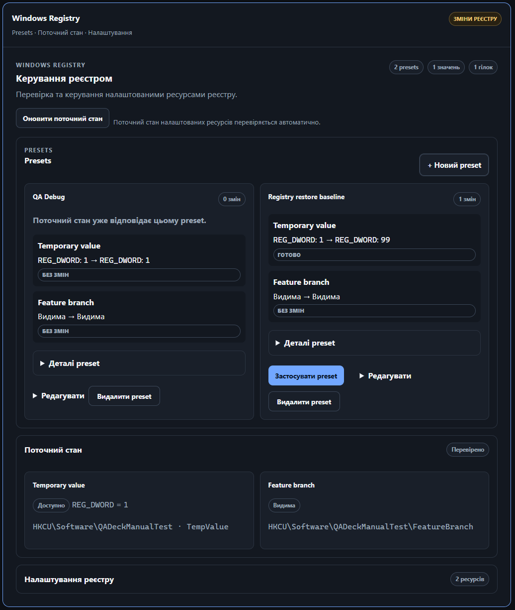
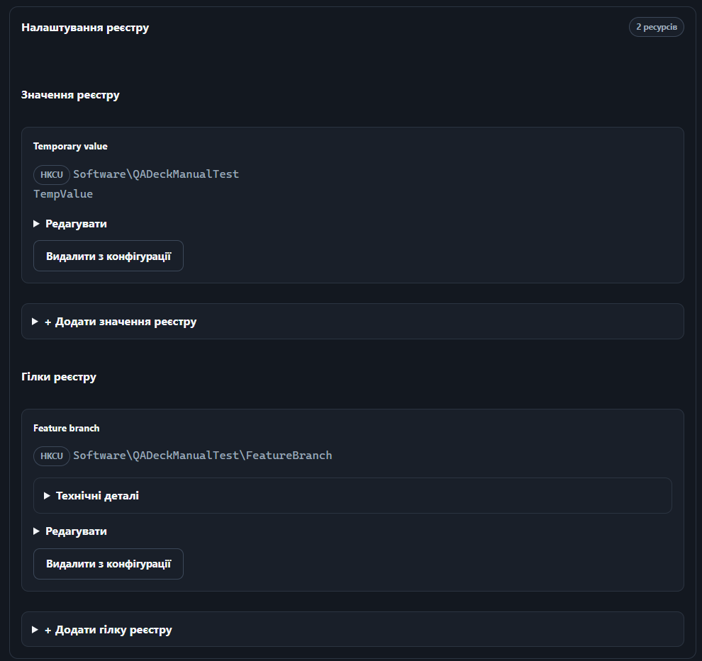
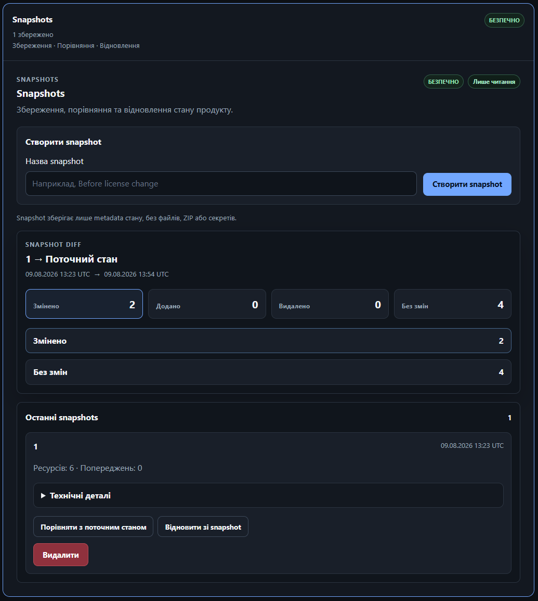
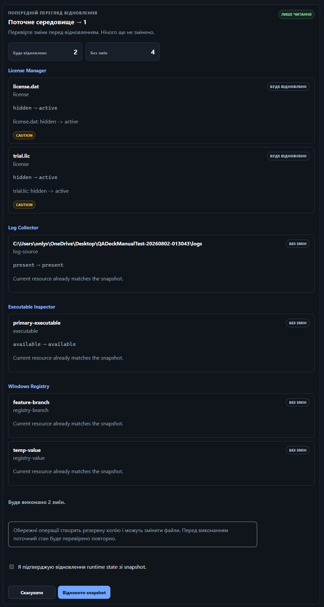
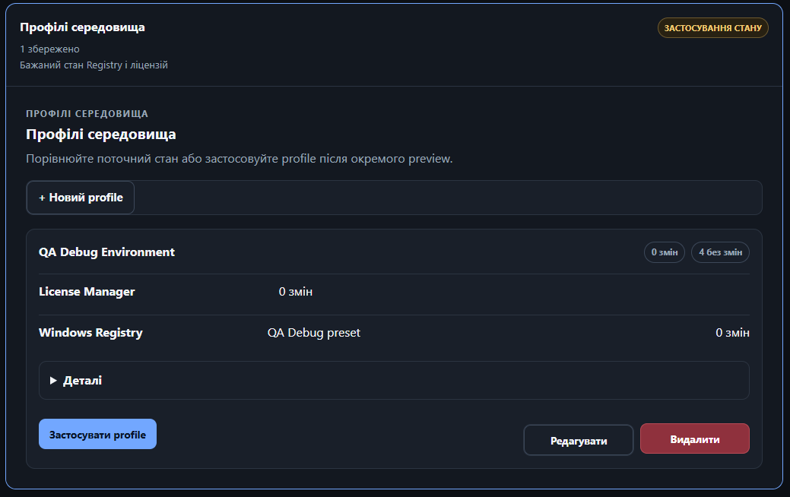
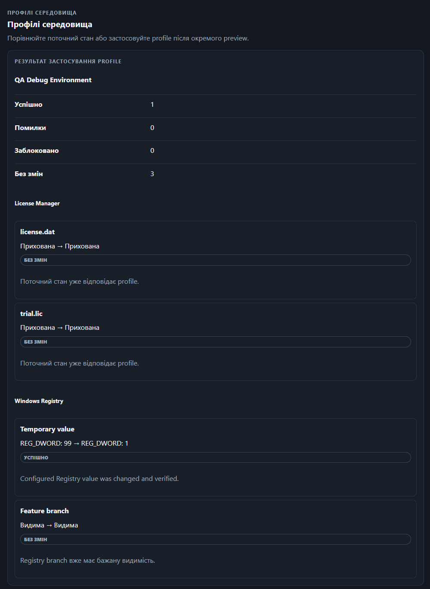
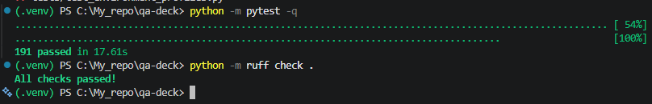

# Звіт за тиждень 3: Snapshots, Windows Registry та Environment Profiles

## 1. Мета тижня

Цього тижня я зосередився на роботі зі станом тестового середовища. Основними
напрямами стали Snapshots, Windows Registry та Environment Profiles. Моєю метою
було не лише показувати поточні дані, а й дати користувачу можливість безпечно
порівнювати, планувати та підтверджувати зміни.

Окрему увагу я приділив перевірці стану перед виконанням, ізоляції помилок
плагінів та ручному тестуванню на Windows. Це було важливо, оскільки операції з
Registry і ліцензійними файлами можуть змінювати реальне локальне середовище.

## 2. Реалізована функціональність

### 2.1 Windows Registry

Я реалізував Product-specific конфігурацію Windows Registry. Користувач може
додати тільки ті Registry values і branches, з якими QA Deck має право
працювати. Для values підтримуються основні типи `REG_*`, зокрема рядкові,
числові, спискові та двійкові значення.

Для повторюваних станів я додав Registry presets. Кожен preset посилається на
вже налаштовані ресурси й задає бажане значення або видимість branch. На
сторінці Product автоматично показується порівняння Current → Desired, тому до
виконання видно реальну різницю.

*Рисунок 1: Presets, поточний стан і ресурси Windows Registry.*

Налаштування values і branches зберігаються окремо для Product. Виконання не
приймає довільний шлях із браузера або snapshot, а повторно знаходить ресурс у
поточній конфігурації.

*Рисунок 2: Налаштовані Registry value та branch тестового Product.*

Перед зміною користувач бачить preview і підтверджує операцію окремо. Registry
value записується з точним типом, після чого QA Deck повторно читає його та
перевіряє результат. Branch приховується або відновлюється через rename, а не
через delete/recreate. Це зберігає вміст branch і робить операцію зворотною.

Я також додав захист від зміни стану або конфігурації після preview. Якщо value,
branch, preset чи його розташування більше не відповідають плану, виконання
блокується. Для помилок після запису передбачено перевірку результату та
спробу відкотити зміну. В Operation Log зберігається підсумок операції без самих
Registry values та інших чутливих деталей.

### 2.2 Snapshots

Я додав збереження фактичного стану Product у певний момент. Snapshot збирає
стан доступних ресурсів через плагіни й зберігається окремо для кожного Product.
Під час збору помилка одного plugin не скасовує весь snapshot: користувач бачить
попередження, а доступні ресурси все одно зберігаються.

Тепер можна:

- створити snapshot із назвою;
- автоматично порівняти його з поточним станом;
- порівняти два збережені snapshots;
- побачити додані, видалені, змінені та незмінені ресурси;
- видалити snapshot після окремого підтвердження;
- відновити підтримувані ресурси через попередній перегляд.

Snapshot Diff показує різницю за стабільною ідентичністю ресурсу, а не лише за
текстом або позицією на сторінці. На прикладі нижче видно дві змінені та чотири
незмінені позиції.

*Рисунок 3: Порівняння snapshot із поточним станом середовища.*

Для Snapshot Restore я реалізував окремий preview. Він показує, що саме буде
відновлено, але нічого не змінює до явного підтвердження. У наведеному сценарії
заплановано відновлення двох ліцензійних файлів, а ще чотири ресурси вже
відповідають snapshot.

*Рисунок 4: Snapshot Restore перед підтвердженням змін.*

Відновлення виконується лише для ресурсів, які можна безпечно зв’язати з
поточною конфігурацією Product. Якщо старий snapshot містить невідомий ресурс
або plugin не підтримує автоматичне відновлення, система показує ресурс як
заблокований або непідтримуваний замість спроби вгадати старий шлях чи target.

### 2.3 Environment Profiles

Snapshot і Environment Profile вирішують різні задачі. Snapshot відповідає на
питання «що було зафіксовано в певний момент», а Environment Profile описує «яким
має бути середовище». Profile не копіює старі шляхи для подальшого запису, а
посилається на актуальні налаштовані ресурси Product.

Я додав створення, редагування та видалення Product-scoped profiles. Один
Environment Profile може поєднувати бажані стани кількох плагінів. У поточній
версії він використовує Registry preset і стани налаштованих ліцензійних
файлів. Сторінка автоматично порівнює Profile з Current і показує кількість
потрібних змін.

*Рисунок 5: Profile з License Manager і Windows Registry.*

Застосування Profile також починається з preview. Після підтвердження сервер ще
раз завантажує Profile, конфігурації та поточний стан. Кожен plugin виконує лише
свою частину плану, а результат показується окремо. На прикладі нижче успішно
змінено одне Registry value, а три інші позиції вже мали бажаний стан.

*Рисунок 6: Результат застосування Environment Profile.*

Помилка одного plugin не приховує результати інших. Водночас система не називає
таке виконання глобальною транзакцією: якщо одна частина завершилася успішно, а
інша ні, користувач отримує чесний частково успішний результат.

## 3. Основні складнощі та їх вирішення

### 3.1 Registry працював у тестах, але виникла помилка на реальному Windows API

Автоматичні тести проходили, але під час ручної перевірки на Windows я виявив
помилку при перейменуванні Registry branch у тестовій області `HKCU`. Проблема
була у взаємодії Python `winreg.PyHKEY` з Windows API.

Після виправлення я повторно перевірив приховування та відновлення branch на
реальному Windows. Цей випадок показав, що навіть при успішних автоматичних
тестах потрібна ручна перевірка взаємодії з Windows API.

### 3.2 Треба було розділити Snapshot і Environment Profile

Обидва механізми працюють зі станом середовища, тому спочатку могли виглядати як
дві версії однієї функції. Я розділив їх призначення: Snapshot зберігає те, що
було, а Profile описує те, що має бути.

Завдяки цьому Profile використовує актуальні посилання на налаштовані ресурси,
а шляхи зі старих snapshots не стають джерелом довільних записів. Спільні
операції залишаються у відповідних плагінах і не дублюються в кожному сценарії.

### 3.3 Стан може змінитися між preview і підтвердженням

Після того як користувач відкрив preview, файл, Registry або конфігурація можуть
змінитися. Виконувати старий план у такій ситуації небезпечно. Тому перед
записом QA Deck ще раз перевіряє поточний стан.

Якщо він уже не збігається з переглянутим, план вважається застарілим або
заблокованим і зміна не виконується. Підтвердження є одноразовим, а оновлення
сторінки результату через F5 не запускає операцію повторно.

### 3.4 Інтерфейс став складнішим разом із функціональністю

Під час ручного тестування я помітив, що велика кількість статусів у Registry,
Snapshots і Profiles ускладнила сторінку Product. Не завжди було очевидно, де
закінчується preview і починається виконання; Snapshot Restore мав недостатньо
зрозумілі формулювання, перехід до результату був незручним, а повідомлення
«Без змін» займали забагато уваги.

Я уточнив назви та пояснення Restore Preview, додав чітку кнопку підтвердження,
стабільну навігацію до результату й зрозумілі причини блокування або відсутності
підтримки ресурсів. Основні сценарії стали читабельнішими, але загальне
візуальне доопрацювання залишається некритичним наступним покращенням.

## 4. Тестування

На кінець тижня повний накопичений набір автоматизованих тестів проєкту містить
191 тест. Цього тижня я доповнив перевірки для нових сценаріїв Snapshot,
Windows Registry та Environment Profile.

Усі 191 тести пройшли успішно. Вони перевіряють основні доменні моделі та
сховища, порівняння й відновлення snapshots, виконання і відкат змін Registry,
License Manager, застосування profiles, ізоляцію плагінів, захист від
застарілого стану та безпечне повторне відкриття сторінок результату. Ruff також
не знайшов проблем.

*Рисунок 7: Повний набір тестів: 191 passed, Ruff passed.*

Окрім автоматизованих тестів, я виконав ручну перевірку в контрольованому
тестовому середовищі. Для неї використав окрему область `HKCU` і тимчасові
ліцензійні файли. Я перевірив Registry value, приховування та відновлення branch,
Snapshot Diff і Restore, а також Environment Profile, який поєднує Registry та
License Manager. Фізичний стан звіряв окремо від тексту у вебінтерфейсі.
Повторне оновлення сторінки через F5 не виконувало вже підтверджені зміни ще раз.

Фінальна перевірка:

- `python -m pytest --collect-only -q`: 191 tests collected;
- `python -m pytest -q`: 191 passed;
- `python -m ruff check .`: All checks passed;
- `git diff --check`: лише відомі інформаційні LF/CRLF notices.

## 5. Поточні обмеження

- Дані підтвердження та результати виконання Snapshot/Profile зараз
  зберігаються в пам’яті процесу та втрачаються після перезапуску.
- Глобальної транзакції між різними плагінами немає, тому змішана операція може
  завершитися частково успішним результатом. Система показує це явно.
- Старий snapshot може залишитися лише для порівняння, якщо його ресурси не
  вдається безпечно зв’язати з поточною конфігурацією.
- Остаточне доопрацювання інтерфейсу і Workflow / Setup ще не завершені.

## 6. План на наступний тиждень

Частина потрібної функціональності Snapshots і Log Collector уже готова, тому
наступний етап я планую зосередити на Workflow / Setup.

Основні завдання:

1. Додати базову Product-scoped модель Workflow / Setup.
2. Реалізувати одну просту послідовність наявних Plugin Actions.
3. Додати preview, явне підтвердження та окремий результат виконання.
4. Написати необхідні unit та integration tests для нового сценарію.
5. Виконати точкові UX-покращення й підготувати другу демонстрацію.
6. Продовжити матеріали пояснювальної записки: опис архітектури, методології,
   тестування та обмежень системи.

## 7. Артефакти

- [Репозиторій QA Deck](https://github.com/NotJod563/qa-deck)
- [README](../../README.md)
- [Контекст проєкту](../PROJECT_CONTEXT.md)
- [Архітектурні рішення](../DECISIONS.md)
- [План розробки](../ROADMAP.md)
- [Звіт за тиждень 1](week-01.md)
- [Звіт за тиждень 2](week-02.md)
