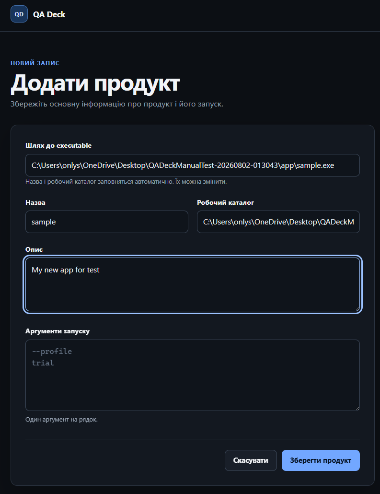
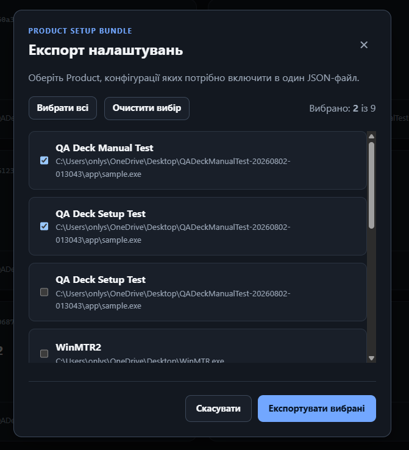
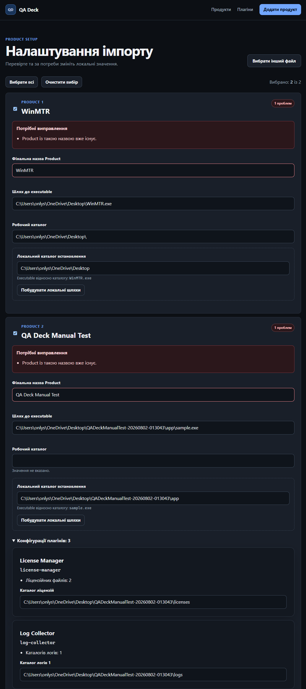
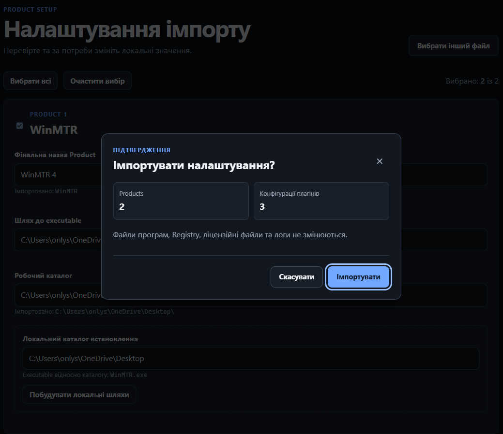
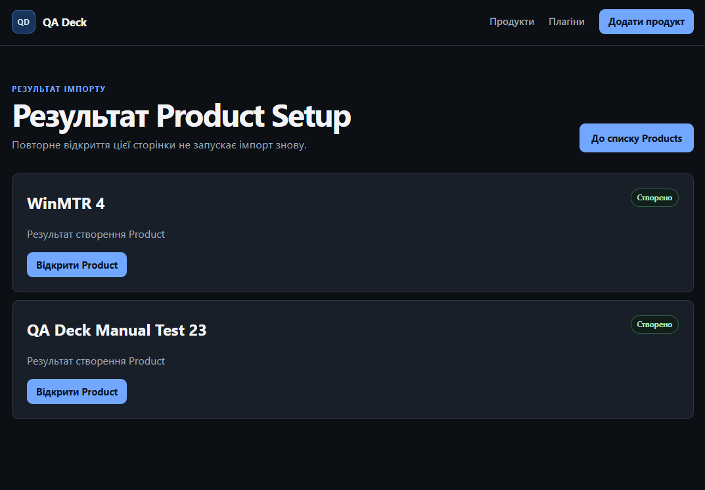
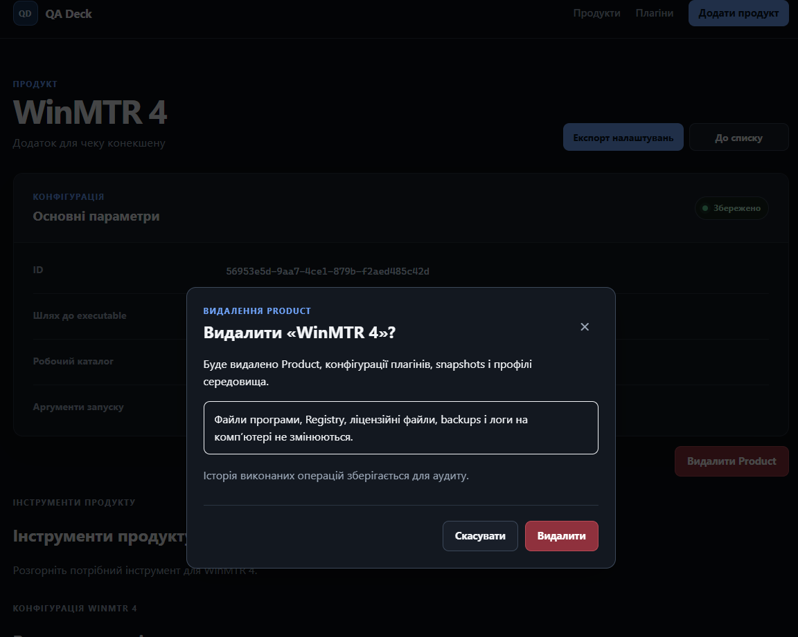
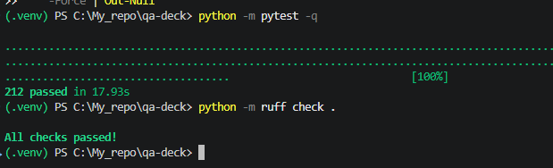

# Звіт за тиждень 4: Product Setup

## 1. Мета тижня

На початку тижня я планував додати простий Workflow / Setup. Під час реалізації
та перевірки стало зрозуміло, що опис або відновлення стану через Workflow
частково повторюватиме Snapshot Restore та Environment Profiles. Тому я
переглянув цей план і зосередився на іншому практичному сценарії: перенесенні
налаштованих Products між користувачами або інсталяціями QA Deck.

Метою стало спростити створення Product, додати безпечний export та import його
конфігурації, а також завершити базове керування Product через видалення.

## 2. Реалізовано

### 2.1 Спрощення створення Product

Основним початковим значенням у формі тепер є шлях до executable. Після його
введення назва Product і робочий каталог заповнюються автоматично. Це лише
початкові значення, тому користувач може змінити їх перед збереженням.

*Рисунок 1: Спрощена форма створення Product з автоматичним заповненням основних значень.*

### 2.2 Product Setup export та import

Я додав Product Setup Package для одного Product і Product Setup Bundle для
кількох Products. Export формує стабільний і зрозумілий JSON-файл. На сторінці
Products можна вибрати кілька записів і зберегти їх в одному Setup Bundle.

Такий сценарій корисний, наприклад, коли старший QA вже налаштував Products і
передає конфігурацію іншому QA. На іншому комп'ютері файл можна імпортувати,
перевірити й адаптувати до локальних каталогів без повторного ручного введення
всіх налаштувань.

*Рисунок 2: Вибір кількох Products для формування одного Setup Bundle.*

Під час import QA Deck автоматично розпізнає один package або bundle. Для шляхів
зберігаються початкові підказки, а відносні представлення використовуються лише
там, де це безпечно. Перед import користувач може змінити назви й локальні шляхи.
Конфлікт з уже наявною назвою Product показується на цій самій сторінці.

*Рисунок 3: Налаштування import з виявленням конфліктів і адаптацією локальних значень.*

Разом із Product передаються підтримувані конфігурації License Manager, Log
Collector і Windows Registry. Registry presets не передаються. Import створює
лише записи Product і конфігурації плагінів у QA Deck. Він не змінює runtime
значення Registry, ліцензійні файли та логи й не запускає збір логів.

Перед створенням сервер перевіряє вибрані значення та формує одноразове
підтвердження. Під час підтвердження стан перевіряється ще раз. Після виконання
відкривається окрема сторінка результату, тому F5 не повторює import. Для bundle
результат показується окремо для кожного Product, включно з частково успішним
виконанням.

*Рисунок 4: Коротке підтвердження перед створенням Products і конфігурацій плагінів.*

*Рисунок 5: Результат import кількох Products.*

### 2.3 Керування Product

Product тепер можна видалити після окремого підтвердження. Разом із ним QA Deck
очищає власні конфігурації плагінів, snapshots та Environment Profiles.
Operation Logs залишаються як історія виконаних дій.

Видалення не змінює executable, каталоги програми, Registry, ліцензійні файли,
backups або початкові логи на комп'ютері. Це пояснено безпосередньо у вікні
підтвердження.

*Рисунок 6: Підтвердження видалення Product з поясненням меж операції.*

### 2.4 Пояснювальна записка

Я підготував перші версії розділу 1 "Вступ" і розділу 2 "Дослідження ринку та
технологічного середовища". Вони готові до початкового перегляду. Розділ 3
"Методологія проєктування" уже має робочу чернетку, яку я оновлюватиму під час
Week 5 після завершення матеріалів про реалізацію та оцінювання.

## 3. Складнощі

### 3.1 Перегляд ролі Workflow

Спочатку я планував використати Workflow як ще один спосіб описувати або
відновлювати стан середовища. Під час перевірки помітив, що це повторює частину
відповідальності Snapshot Restore та Environment Profiles. Після цього я
переглянув план і переніс увагу Week 4 на передачу конфігурації через Product
Setup. Так у проєкті не з'явилася ще одна модель того самого стану.

### 3.2 Переносимі та локальні шляхи

Абсолютний шлях з одного Windows-комп'ютера часто не працює на іншому. Водночас
автоматично вгадувати нове розташування небезпечно. Тому початкові значення
залишаються підказками, відносні шляхи використовуються лише у безпечних
випадках, а локальні значення можна адаптувати перед import.

### 3.3 Безпечний import

Імпортований JSON-файл не повинен давати право змінювати довільний стан Windows.
Тому Product Setup створює лише конфігурацію всередині QA Deck. Registry runtime
values, ліцензійні файли та логи залишаються без змін. Перевірка підтвердження й
актуального стану виконується на сервері.

### 3.4 Спрощення import UX

Перша версія мала окремі екрани Preview, Local adaptation, Final review і
Confirmation. Під час ручної перевірки стало видно, що на них повторюється та
сама інформація. Я об'єднав вибір, конфлікти та локальну адаптацію на одній
сторінці. Після неї залишив короткий діалог підтвердження і сторінку результату.
Під час цього огляду також скоротив повторювані пояснення в наявних preview
flows.

## 4. Тестування

На кінець Week 4 повний накопичений набір автоматизованих тестів проєкту містить
212 тестів. Усі 212 тестів пройшли успішно. Ruff і `git diff --check` також
пройшли без помилок.

*Рисунок 7: Результат фінального запуску автоматизованих тестів і Ruff.*

Я також вручну перевірив Product Setup у браузері: автоматичні початкові
значення при створенні Product, export кількох Products, виявлення конфлікту
назв, локальну адаптацію, підтверджений import, безпечне оновлення результату
через F5 і видалення Product. Окремо перевірив, що import та видалення не
змінюють runtime Registry, ліцензійні файли, логи й файли програми.

## 5. Обмеження

- Registry presets не передаються.
- Environment Profiles і Snapshots не входять до Product Setup packages.
- Import не об'єднує і не перезаписує наявні Products.
- Автоматичне вгадування локальних шляхів навмисно не реалізоване.
- Розширення dashboard і навігації через плагіни залишається майбутньою роботою.

## 6. Наступний тиждень

На Week 5 я планую додати мінімальну Jira Integration як optional plugin і
перевірити передачу корисного артефакту або посилання на конфігурацію там, де це
доречно. Також потрібно підготувати приклад або шаблон для розробника плагіна,
написати розділ методології пояснювальної записки та зібрати матеріал для
результатів і обговорення на основі реалізованих ручних сценаріїв.

Якщо залишиться час, можна додати лише невелику основу для навігації або дій,
які надає плагін.

## 7. Артефакти

- [Репозиторій QA Deck](https://github.com/NotJod563/qa-deck)
- [README](../../README.md)
- [Контекст проєкту](../PROJECT_CONTEXT.md)
- [Архітектурні рішення](../DECISIONS.md)
- [План розробки](../ROADMAP.md)
- [Звіт за тиждень 1](week-01.md)
- [Звіт за тиждень 2](week-02.md)
- [Звіт за тиждень 3](week-03.md)
